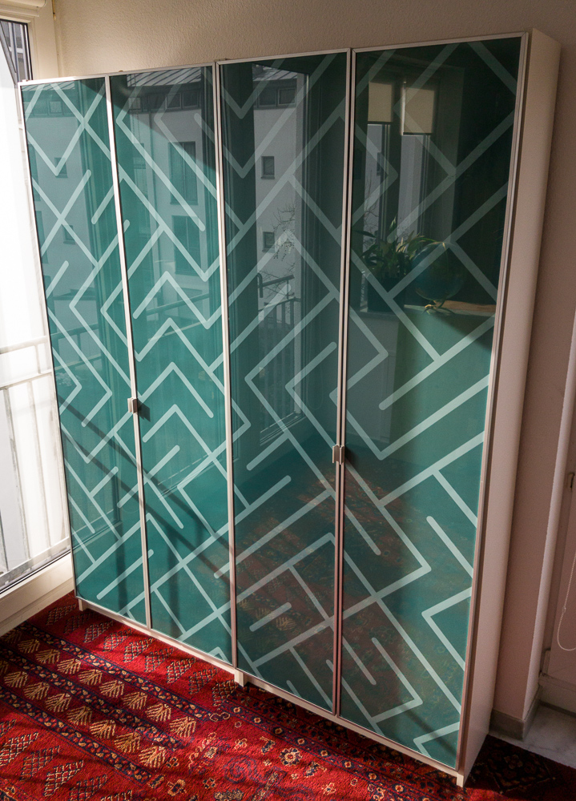
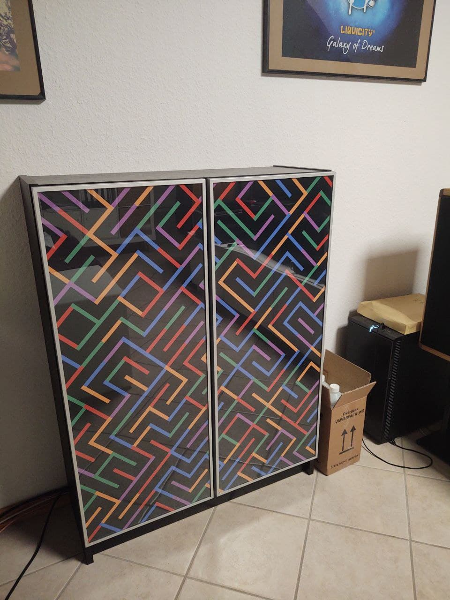

## TL;DR

A small Processing for Java program which outputs large printable graphics for picture frames or glass doors on furniture.

## Long version

This Processing for Java script solved one purpose for me and I am really happy with the result so I thought it could be useful for others.

I have two IKEA Billy shelves next to each other, each with two IKEA Morliden glass doors which can be used as a large picture frame :framed_picture:. I wanted to put something in it but couldn't find a picture with a sufficient resolution.

[This video](https://www.youtube.com/watch?v=bEyTZ5ZZxZs) inspired me to do my first [Processing](https://processing.org/) project.

The program does two things:

1. It creates a graphic, in my case a TenPrint clone.
2. It slizes the graphic into four parts and saves them seperatly. This step considers:
    * padding for the door frames so the graphic doesn't shift from door to door. 
    * [bleed](https://www.wikiwand.com/en/Bleed_(printing)) for the printing house.

After running the program I just had to open the graphics with Photoshop/Gimp and set the correct ppi (300 in my case), convert it to CMYK using the color profile my printing house provided and save it as PDFs. No scaling or cropping required.

## The Result 

I am sure you can adjust the program for your specific needs. Have fun and please share the results with me :framed_picture: :+1:

## Remixes

### Half-height + Colors

`framed10print_half_height_colors.pde` contains a remix of the original design adapted for the half-height 106cm Billy/Morliden.
Furthermore, colors are selected at random from the palette used by the Github dark theme.

The output was converted into the file format required for printing by using imagemagick:

`convert door2.tif -colorspace CMYK -profile ISOcoated_v2_300_eci.icc -density 300 -units pixelsperinch door2_CMYK.pdf`

and ordered from [Wir machen Druck](https://www.wir-machen-druck.de/plakat-mit-freier-groesse-einseitig-40farbig-bedruckt-topseller.html)
as a 1-sided 378 x 954mm 135g poster for around 17 € including shipping. The color profile used can also be downloaded from that page.

You can of course use any print service you like

